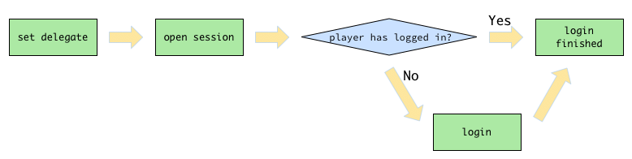
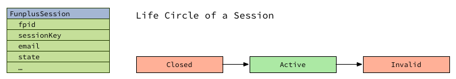

# Account Guide

The account module enables players to sign into your game with Funplus login. Basic patterns when using Funplus login are described here:

1. When game is launching for the very first time, a manual login is required.
2. An automatic login is performed everytime after that when game is starting.
3. If the automatic login in *step 2* fails, a manual login is required.
4. Player will be required to bind his/her account to email or SNS account if the player keeps using express login, based on security considerations.
5. A user center can be shown at any time after player has logged in, to provide additional functions like 'logout' or 'open support center'.

## The Basic Login Flow

To sign a player in, basically you should follow the steps listed below:

1. Set a delegate class to the account module, so that your game can receive notifications sent by Funplus SDK.
2. Open the player's session.
3. During *step 2*, player might have logged in automatically. If not, you need to call the `login` method.
4. Player logs in successfully.



## Session

During the life circle of a game process, status and properties of the player may change quite often. Session hide the complexity behind this.

There is only one session in each game process. When player successfully logs in, session becomes active.



## The Delegate Class

To keep up with the current status of the player, you should implement the `FunplusAccount.Delegate` interface, which is defined as below:

``` java
[FunplusAccount]
public interface Delegate {
	void onOpenSession(boolean isLoggedIn);
    void onLoginSuccess(FunplusSession session);
    void onLoginError(FunplusError error);
    void onBindAccountSuccess(FunplusSession session);
    void onBindAccountError(FunplusError error);
    void onResetPasswordPending(String fpid);
    void onResetPasswordError(FunplusError error);
    void onLogout();
    void onCloseUserCenter();
}
```

When player's status changes, Account SDK will notify game by calling specific method in your delegate class.

These methods can be divided into four groups:

- When the session is opened, `onOpenSession()` will be called.
- `onLoginSuccess()`/`onLoginError()`/`onLogout()`.
- `onBindAccountSuccess()`/`onBindAccountError()`.
- `onResetPasswordPending()`/`onResetPasswordError()`.
- When user center is closed, `onCloseUserCenter()` will be called.

### The `onOpenSession()` Method

``` java
[FunplusAccount.Delegate]
void onOpenSession(bool isLoggedIn);
```

This method will be called after session is opened. The `isLoggedIn` parameter indicates whether player has automatically logged in or not. Usually you don't need to pay much attention on it. However, when a player failed to automatically login, you need to guide the player to login manually.

### The `onLoginSuccess()` and `onLoginError()` Methods

``` java
[FunplusAccount.Delegate]
void onLoginSuccess(FunplusSession session);

[FunplusAccount.Delegate]
void onLoginError(FunplusError error);

[FunplusAccount.Delegate]
void onLogout();
```

The `onLoginSuccess()` method will be called when player logges in successfully. The `session` parameter is gonna to be your good friend. Likewise, the `onLoginError()` method will be called when player fails to login.

The `onLogout()` method will be called when player logges out.

### The `onBindAccountSucces()` and `onBindAccountError()` Methods

``` java
[FunplusAccount.Delegate]
void onBindAccountSuccess(FunplusSession session);

[FunplusAccount.Delegate]
void onBindAccountError(FunplusError error);
```

Right after a player binds his/her account successfully, the `onBindAccountSuccess()` method will be called; If this operation fails,  the `onBindAccountError()` method will be called.

You can find more information about account binding down below the Account Binding section.

### The `onResetPasswordPending()` and `onResetPasswordError()` Methods

``` java
[FuplusAccount.Delegate]
void onResetPasswordPending(String fpid);

[FunplusAccount.Delegate]
void onResetPasswordError(FunplusError error);
```

When player clicks the `Reset Password` button, a password reseting request will be sent to the Funpus Passport Server. If the request is successful, the `onResetPasswordPending()` method will be called. Player is required to go to a web page to reset his/her password. Otherwise, the `onResetPasswordError()` method will be called.

### The `onCloseUserCenter()` Method

``` java
[FunplusAccount.Delegate]
void onCloseUserCenter();
```

Game usually pauses itself when user center is about to show. Therefore, there must be a way for Account SDK to notify game to continue from the point where game paused at. This method will be called when user center is closed.

## Open Session

After Funplus SDK is successfully installed, implement the delegate interface and set it to the account module.

``` java
public class YourDelegateClass implement FunplusAccount.Delegate {

    public void onOpenSession(bool isLoggedIn) {}

    // ...
}

FunplusAccount.getInstance().setDelegate(new YourDelegateClass());
```

Now start the game session manually:

``` java
// Open session.
FunplusAccount.getInstance().openSession();
```

Once you have done so, Account SDK will open the session and try to log player in automatically.

### Login and Logout

Account login and logout are the basic functions of the account module. Put your codes in `onLoginSuccess()` and `onLoginError()` to complete game logic.

``` java
void onLoginSuccess(FunplusSession session) {
    // Login successfully.
    // Game starts.
}

void onLoginError(FunplusError error) {
    // Login failed.
    // Use `error.getErrorMsg()` to see error details.
}
```

Commonly, when game is starting, player will be logged in automatically. However, there are chances that player fails to automatically login. You should check if player has logged in or not in `onOpenSession()`. By calling `FunplusAccount.getInstance().login()`, a login window will be shown.

``` csharp
void onOpenSession(bool isLoggedIn) {
    if (isLoggedIn) {
        // Player has logged in automatically, do nothing.
    } else {
        FunplusAccount.getInstance().login();
    }
}
```

Developers might want to use their own login window, in consideration of a more cohesive style with their game. In this case, we can pass a specific account type to the `login()` method as following:

``` java
FunplusAccount.getInstance().login(FunplusAccountType.Email);
FunplusAccount.GetInstance().Login(FunplusAccountType.Facebook);
```

Here is a list of available account types:

- `Express`: quick sign in to Funplus without showing any window. 
- `Email`: redirect to Funplus login.


- `Facebook`: redirect to Facebook login.

After player successfully logs in, game server need to verify the player's session key in case of fake identities. Please refer to the #Verify-Session section for more details.

Put your logout codes in `onLogout()`.

``` java
void onLogout() {
    // Logout.
}
```

### Account Binding

Most players tend to choose "express login" when starting the game, because this is the simplest way to sign into the game.

However, for security considerations, account SDK will request player to bind his/her account to email or SNS account afterwards.

Put your codes in `onBindAccountSuccess()` and `onBindAccountError()` to complete game logic.

``` java
void onBindAccountSuccess(FunplusSession session) {
    // Account binding successfully.
    // Game restarts using the new session.
}

void onBindAccountError(FunplusError error) {
    // Account binding failed.
}
```

### Reset Password

// TODO

### User Center

To show the user center in game, call `showUserCenter()` method.

``` java
FunplusAccount.getInstance().showUserCenter();
```

These operations can be done in the user center window:

- Logout, `onLogout()` will be called.
- Bind account, `onBindAccountSuccess()` or `onBindAccountError()` will be called.
- Close user center, `onCloseUserCenter()` will be called.

Be careful that the `onCloseUserCenter()` callback will be called only when user does nothing but close the user center directly.

### Update Current User's Information

Whenever the current user's information changes, such as the user's level goes up, you need to notify Funplus SDK about that.

You notify the SDK by calling the `logUserInfoUpdate()` method:

``` java
[FunplusSdk]
public static void logUserInfoUpdate(String serverId,
                              		 String userId,
                              		 String userName,
                              		 String userLevel,
                              		 String userVipLevel,
                              		 boolean isPaidUser);
```

The `userInfo` parameter should contain the following keys and their corresponding values:

- `serverId`: The server ID where the player is in.
- `userId`: Player's in-game ID.
- `userName`: Players's in-game name.
- `userLevel`: Player's current in-game level.
- `userVipLevel`: Player's current VIP level.
- `isPaidUser`: This value indicates whether the player is a paid user or not.

## Verify Session

In case of fake identities, **game server** must verify the session with Funplus Passport after player logs in.

### Step 1: Retrieve the Session Key

In the `FunplusAccount.IDelegate.OnLoginSuccess(FunplusSession session)` method, we retrieve the session key from current active session:

``` csharp
session.GetSessionKey();
```

### Step 2: Verify the Session Key

Game server verify the session key we've just retrieved by sending a request to Funplus Passport Server. The verification API is defined as follow.

``` bash
Endpoint: http://passport.funplusgame.com/server_api.php
Method: POST
Request content type: application/x-www-form-urlencoded
Request body: "method=check_session&session_key=<YOUR_SESSION_KEY>"
Response code: 200
Response content type: application/json
```

Here is an example:

``` bash
 curl "http://passport.funplusgame.com/server_api.php" \
      -d "method=check_session&session_key=20wkXZxTCxjcqZyeuuWCo2tz0p2HRSMUh8N0gagGmkzlTYev3w"
```

### Step 3: Parse the Verification Result

Here is the response of the above request, in which the session key is valid:

``` json
 {
   "status": 1,
   "data": {
     "fpid": "17474850",
     "expire_in": 1990810
   }
 }
```

If the value of `status` is not `1`, we consider the session key is invalid. The `error` field may differ due to different situations. Example:

``` json
 {
   "status": 0,
   "error": 1128,
   "data": []
 }
```