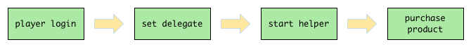

# Google IAB

## Requirements

Make sure the following requirements are satisfied:

* The `<uses-permission android:name="com.android.vending.BILLING" />` permission.
* The dependency on the latest google-play-services-lib.

## The Basic Purchase Flow

To purchase a product, basically you should follow the steps listed below:

1. After player logs in, set a delegate class to Google IAB, so that your game can receive notifications sent by Funplus SDK.
2. Start the Google IAB Helper.
3. Purchase a product.



## The Delegate Class

To keep up with the status of Google IAB, you should implement the `FunplusGoogleiab.Delegate`:

``` java
[FunplusGoogleiab]
public interface Delegate {
    void onInitializeSuccess(JSONArray productsInfo);
    void onInitializeError(FunplusError error);
    void onPurchaseSuccess(String productId, String throughCargo);
    void onPurchaseError(FunplusError error);
}
```

Each method is described below.

### The `onInitializeSuccess()` Method

``` java
[FunplusGoogleiab.Delegate]
void onInitializeSuccess(JSONArray productsInfo);
```

If Google IAB helper is initialized successfully, this method will be called. You can retrieve information of all the available products from the callback parameter, `productsInfo`.

`productsInfo` is a JSON array, the fields in each array element of `productsInfo` are summarized below.

| Key                   | Description                              |
| --------------------- | ---------------------------------------- |
| `productId`           | The product ID for the product.          |
| `type`                | Value must be "inapp" or "subs".         |
| `price`               | Formatted price of the item, including its currency sign. |
| `price_amount_micros` | Price in micro-units, where 1,000,000 micro-units equal one unit of the currency. |
| `price_currency_code` | [ISO 4217 currency code](http://en.wikipedia.org/wiki/ISO_4217#Active_codes) for price. |
| `title`               | Title of the product.                    |
| `description`         | Description of the product.              |

### The `onInitializeError()` Method

``` java
[FunplusGoogleiab.Delegate]
void onInitializeError(FunplusError error);
```

If SDK fails to initialize Google IAB helper, this method will be called.

### The `onPurchaseSuccess()` Method

``` java
[FunplusGoogleiab.Delegate]
void onPurchaseSuccess(String productId, String productId);
```

After game calls `FunplusGoogleiab.getInstance().buy()`, if player succeed to buy a product, this method will be called. `productId` is the ID of the product which player has just bought; `throughCargo` is a developer load which might be helpful for game server to do some validation work.

### The `onPurchaseError()` Method

``` java
[FunplusGoogleiab.Delegate]
void onPurchaseError(FunplusError error);
```

After game calls `FunplusGoogleiab.getInstance().buy()`, if player fails to buy a product, this method will be called.

## Start the Helper

After player successfully logs in, implement the delegate interface and set it to the Google IAB module.

``` java
public class YourDelegateClass implement FunplusGoogleiab.Delegate {
    public void onInitializeSuccess(JSONArray productsInfo) {}

    // ...
}

// After player logs in.
FunplusGoogleiab.getInstance().setDelegate(new YourDelegateClass());
```

Now start the Google IAB helper manually:

``` java
// Start the helper.
FunplusGoogleiab.getInstance().startHelper();
```

Once you have done so, the SDK will start the Google IAB helper.

## Retrieve Products Information

You get the products information from the `onInitializeSuccess()` callback, as we've discussed above.

## Buy a Product

To buy a product, call the `buy()` method.

``` java
FunplusGoogleiab.getInstance().buy(productId, throughCargo);
```

- `productId`: The product's unique ID.
- `throughCargo`: Game server's developer load.

